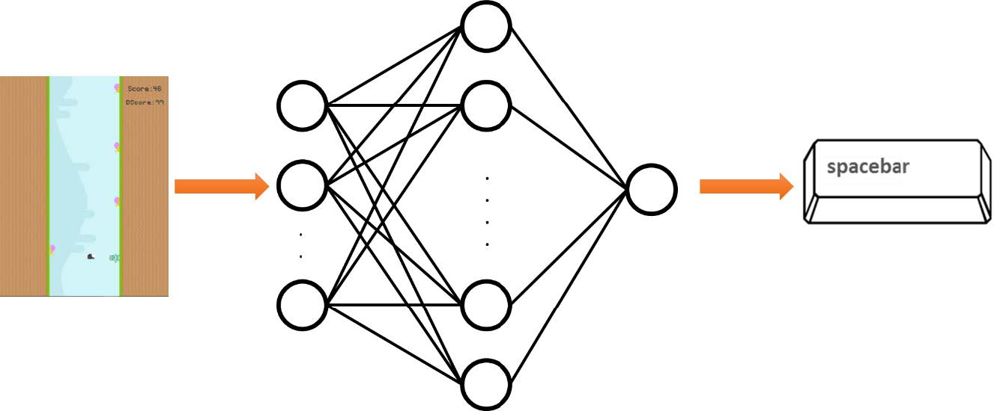

<!-- PROJECT LOGO -->
 

<h2 align="center">Neuroevolution Game
</h2>

 This project is part of Computational Intelligence course.

    

 

## Quick links

* [Overview](#overview)
* [Implementation](#implementation)

## Overview

In this project we will use the evolutionary algorithm to train the neural network in a game space where we don't have enough data to train the model on it's own. In the case of our game, <b>Snail Jumper</b>, the player constantly faces new obstacles (snails) as it goes forward, and there is no way for us to produce training data from an ever changing game setup.
 
After running the `game.py` you can choose `Start Game` to play it yourself using `space` key to jump and see the actual layout of the game.

## Implementation

We want to have a neural network that replicates the action of pressing `space` to jump. So we will feed it input based on game environment and through Feedforward and Backpropagation it will determine weather the player should jump or not.

    

 

The problem is that we don't have data to train this model with. So we use Evolutionary Algorithm by creating 150 players, each with their own neural network. For all of these neural networks at each point, we will create an input vector (`create_input_smart`) based on obstacles that are visible to player (within the game screen) and position of the player itself. Weights and biases for these neural networks are different and random since we're not training them and using the evolutionary algorithm, this is equivalent of Population Initialization. Given the difference in neural networks and their architecture each player will act differently in face of obstacles. Some will jump and some will hit the obstacle and die. The player that has gone the furthest in the game has the highest fitness value. So based on evolutionary algorithm and `Q_tournament` players with higher fitness value will go to the next generation and play the game one more time. In each generation by applying `crossover` and `mutation` we improve on players neural network and it's ability to go further in the game and score higher each time.